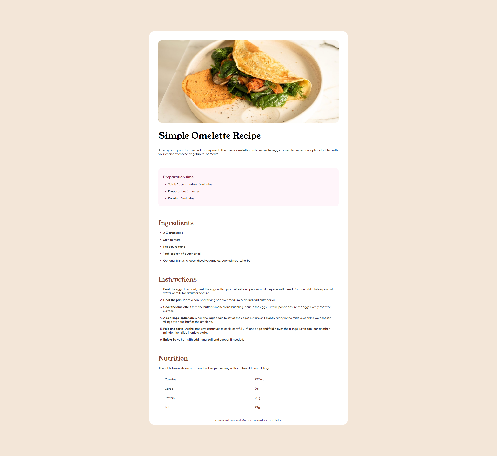
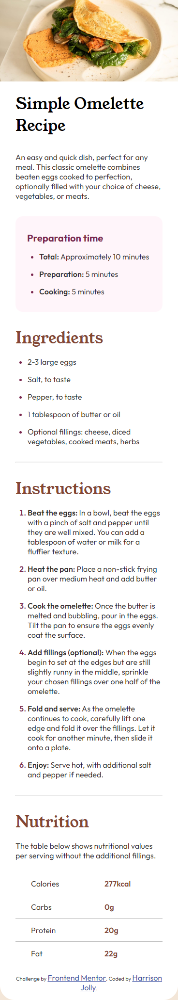

# Frontend Mentor - Recipe page solution

This is a solution to the [Recipe page challenge on Frontend Mentor](https://www.frontendmentor.io/challenges/recipe-page-KiTsR8QQKm). Frontend Mentor challenges help you improve your coding skills by building realistic projects. 

## Table of contents

- [Overview](#overview)
  - [Screenshot](#screenshot)
  - [Links](#links)
- [My process](#my-process)
  - [Built with](#built-with)
  - [What I learned](#what-i-learned)
  - [Continued development](#continued-development)
  - [Useful resources](#useful-resources)
- [Author](#author)

## Overview

This is my first [Frontend Mentor](https://www.frontendmentor.io) challenge and I'm already loving this site! It's much better than following a long with a youtube video as it actually forces me to think. I know this first project isn't perfect and but I'm happy with the end results. (Just don't view the site on small screens wider that 375px)

### Screenshot




### Links

- Solution URL: [My repo](https://github.com/Harrison-Jolly/recipe-page-main-newbie-challenge)
- Live Site URL: [My live site](https://hj-recipe-page-challenge.netlify.app/)

## My process

### Built with

- Semantic HTML5 markup
- CSS custom properties
- Flexbox
- CSS Grid

### What I learned

This project was mainly a bit of practice for using grid and flexbox but it did lead me to learn you could change the `<li>` markers using `li::marker`.

```
li::marker {
    color: hsl(332, 51%, 32%);
}
```

### Continued development

I'm aware that I should have focused on the mobile site first approach but this was mny first project I've tried on [Frontend Mentor](https://www.frontendmentor.io) so I got carried away trying to copy the site and didn't plan ahead properly. For future projects I'm going to use the mobile first approach.

Also I couldn't figure out how to get put some space between the text of the `<ol>` bullet points and the bullet points themselves so I need to ask someone about that.

### Useful resources

- [A Complete Guide to Flexbox](https://css-tricks.com/snippets/css/a-guide-to-flexbox/) - I have to mention this site as its my goto whenever flexbox is involved.

## Author

- Website - [Add your name here](https://www.your-site.com)
- Frontend Mentor - [Harrison-Jolly](https://www.frontendmentor.io/profile/Harrison-Jolly)
- LinkedIn - [Harrison-Jolly](www.linkedin.com/in/harrison-jolly-0886a9260)

